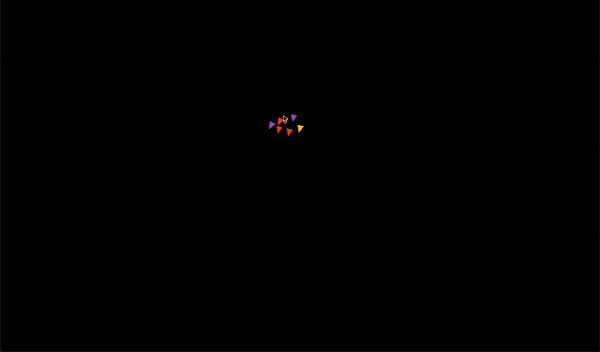

# Boids Flocking Simulation
2D implementation of [Craig Reynolds' Boids](https://en.wikipedia.org/wiki/Boids). Created using my own SDL2 wrapper called [Argon](https://github.com/OwenK2/Argon-SDL2-Wrapper).

## Getting Started / Installation
- Ensure [SDL2](https://www.libsdl.org/download-2.0.php) is installed
- Run `make` to create the executable
- Run the executable

## How to use
Click and hold to create boids  
Press Enter/Return to clear all boids

## Screenshot

## License
This project is licensed under the [MIT License](LICENSE)

